# nlp-with-disaster-tweets

## 1. Description
### About
Twitter has become a crucial communication channel in emergencies. The ubiquity of smartphones enables people to announce emergencies they're observing in real-time. Consequently, more agencies are interested in programmatically monitoring Twitter (e.g., disaster relief organizations and news agencies). However, it's not always clear whether a person's words are actually announcing a disaster.
### Objective
The goal is to distinguish fake news from real news by training a model that can make this distinction. I'll start with a short section on text mining and then contrast different concepts from N-grams to embeddings to transformers.

The size of train data: 7613
The size of test data: 3263
Target counts:
0|4342
1|3271

## 2. EDA
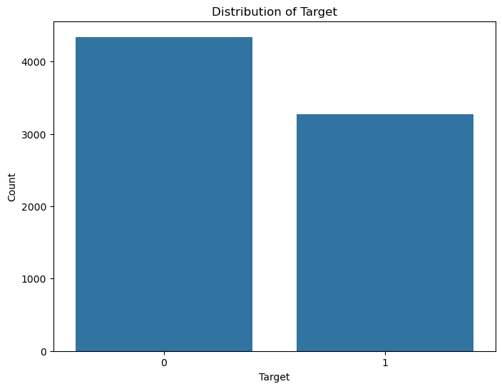
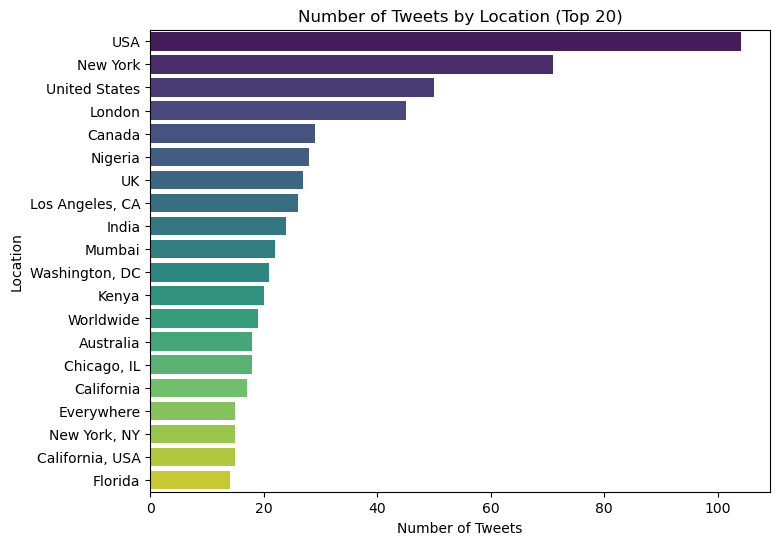
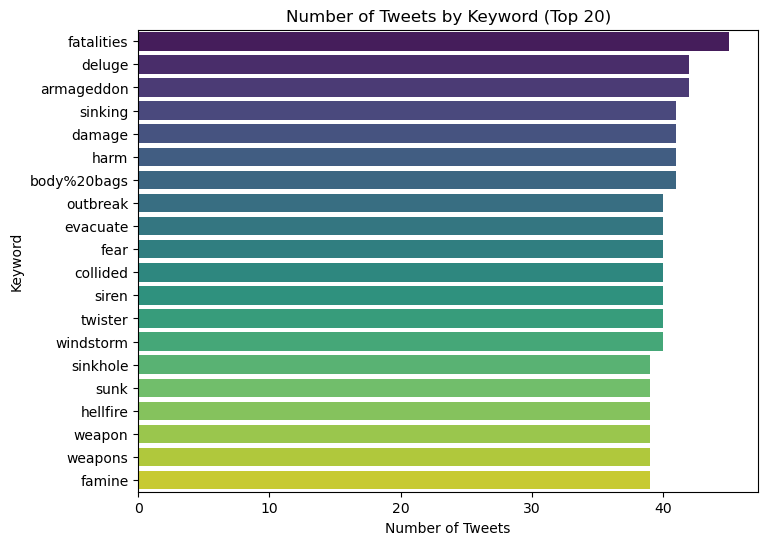
- Compare the distributions of text lengths between the train and test datasets.
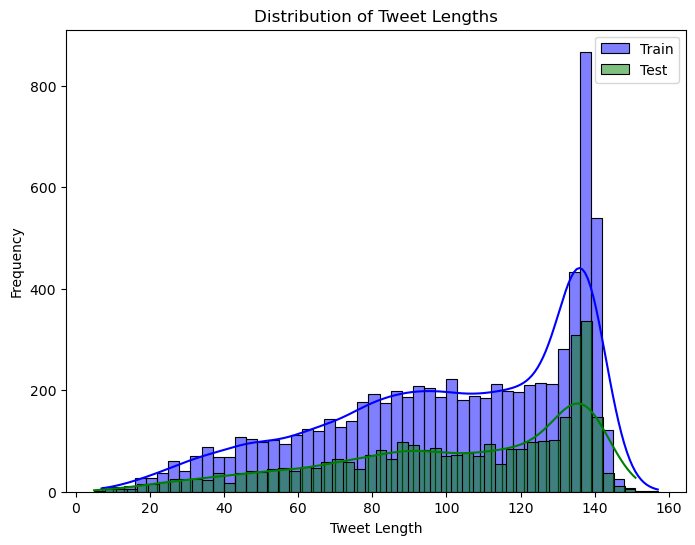

### Missing 
- The location variable have significant missing values.
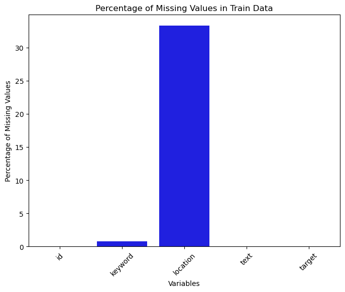
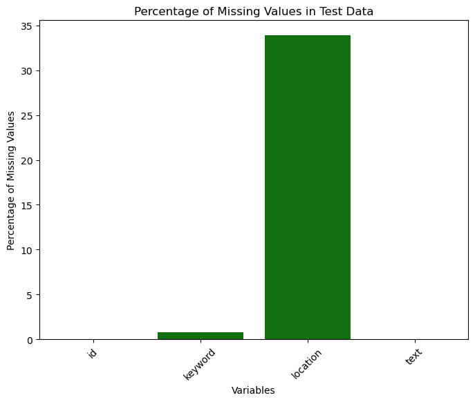

### Text preprocessing
- Text preprocessing is a crucial step in preparing raw text data. This process involves several steps, such as converting text to lowercase, removing URLs, mentions, hashtags, and punctuation, and tokenizing the text. 
- visualize word frequencies and analyze bigrams (pairs of consecutive words) and trigrams (triplets of consecutive words). These visualizations help in identifying common terms and phrases that might be important for distinguishing disaster-related tweets from non-disaster-related ones.
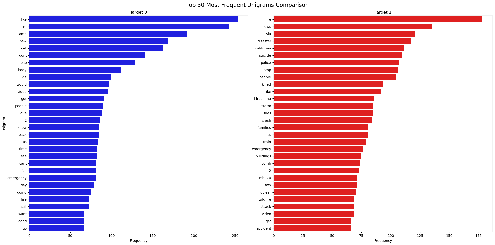

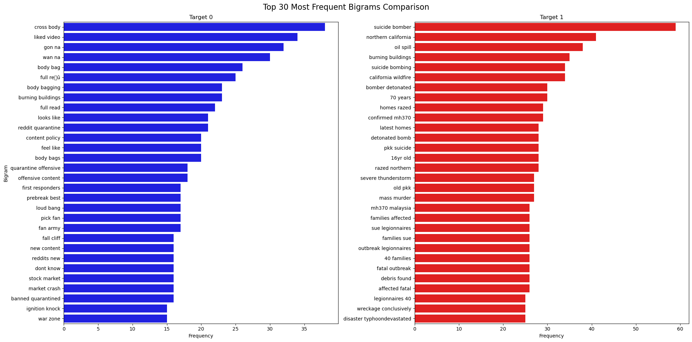
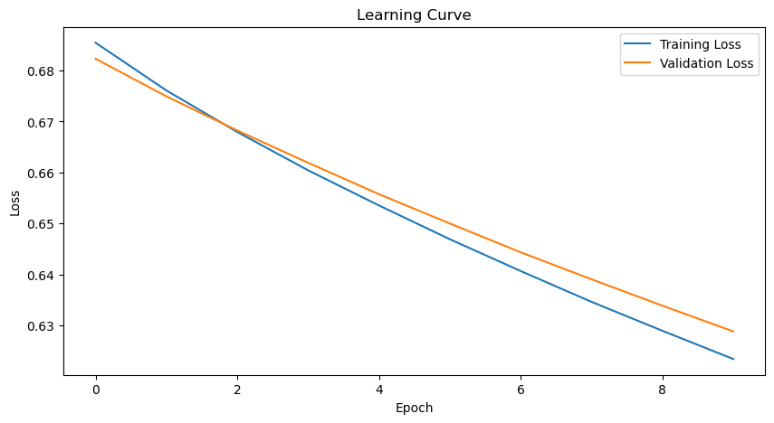
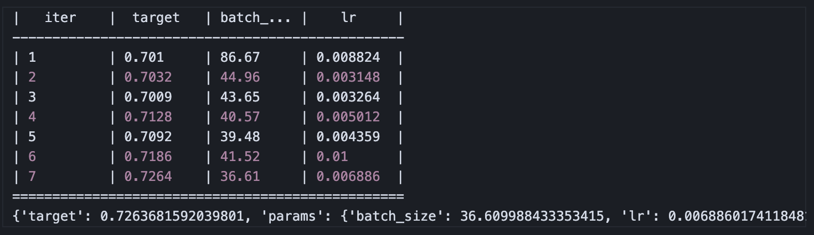
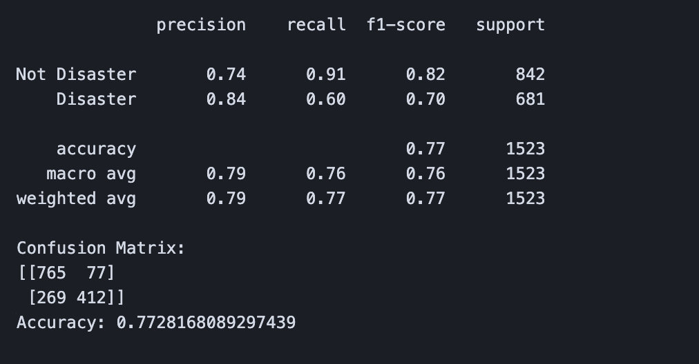

## 3. Architecture
### Choosing a Word Embedding Method
There are several methods for converting text to word embeddings: TF-IDF, GloVe, and Word2Vec. Let's briefly compare these methods and their suitability for this particular problem.
#### 1. TF-IDF (Term Frequency-Inverse Document Frequency)
- Description: TF-IDF is a statistical measure used to evaluate the importance of a word in a document relative to a collection of documents (corpus). It is calculated by multiplying the term frequency (TF) of a word by its inverse document frequency (IDF).
- Advantages:
  - Simple and easy to implement.
  - Effective for tasks where the frequency of terms is important.
- Disadvantages:
  - Creates sparse vectors, which can be computationally expensive.
  - Does not capture the semantic meaning of words.
#### 2. Word2Vec
- Description: Word2Vec is a neural network-based approach that learns dense vector representations for words by predicting neighboring words in a context window. It uses two models: Continuous Bag of Words (CBOW) and Skip-Gram.
- Advantages:
  - Produces dense, low-dimensional vectors.
  - Captures semantic relationships between words.
  - Efficient for large datasets.
- Disadvantages:
  - Requires significant computational resources for training on large corpora.
  - Context size is fixed, which can limit its ability to capture long-range dependencies.
#### 4. GloVe (Global Vectors for Word Representation)
- Description: GloVe is a count-based method that generates word embeddings by factorizing a word co-occurrence matrix. It combines the advantages of both word count statistics and prediction-based models like Word2Vec.
- Advantages:
  - Produces dense, low-dimensional vectors.
  - Captures both local and global statistical information.
  - Pre-trained models are available, which saves computational resources.
- Disadvantages:
  - Requires a large corpus to generate high-quality embeddings.
  - Fixed-size vectors may not capture nuanced context as well as dynamic models like BERT.
Use Case: Suitable for tasks where capturing both local and global context is important. Pre-trained models make it a good choice for projects with limited computational resources.
#### Conclusion
I'll use GloVe embeddings. GloVe strikes a good balance between capturing semantic relationships and computational efficiency. Pre-trained GloVe embeddings can be easily integrated into your model, allowing me to leverage high-quality word vectors without the need for extensive computational resources.

## 4. Results and Analysis

## 5. Conclusion

## 6. Submission
